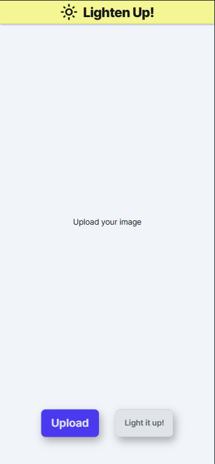
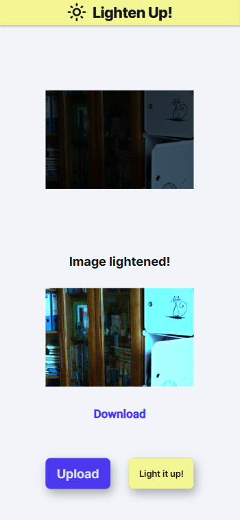

# Lighten Up!

**Lighten Up!** is an app developed with Flutter for low-light image enhancement using the Zero-DCE model trained on the LoL dataset.

_Note: This repository was pushed from FlutterFlow, except for the Jupyter Notebook and APK._

## App Preview

### Main Features

- Upload media
- Enhance low-light image
- Download enhanced result

## Getting Started

#### How to Install and Use the *Lighten Up!* APK

You can try the app by installing the **Lighten Up APK** on your Android device. Follow these steps:

##### Step 1: Download the APK

* Click on the **Lighten Up APK.zip**
* Download and **extract** the ZIP file to get the `.apk` file.

##### Step 2: Install the APK

1. **Transfer the APK** file to your Android device (via USB, Google Drive, email, etc.).
2. On your device, go to **Settings > Security** (or **Privacy**) and enable **"Install from unknown sources."**
3. Locate the APK file using your file manager and tap to **install it.**

> ⚠️ *Note: You may be prompted with a warning about unknown apps. This is normal for non–Play Store apps.*

##### Step 3: Use the App

1. Open the **Lighten Up!** app.
2. Tap **Upload** to select a low-light image.
3. Tap **Light it up!** to process the image.
4. Once enhanced, the improved image will be displayed.
5. Tap **Download** to save the result to your device.
