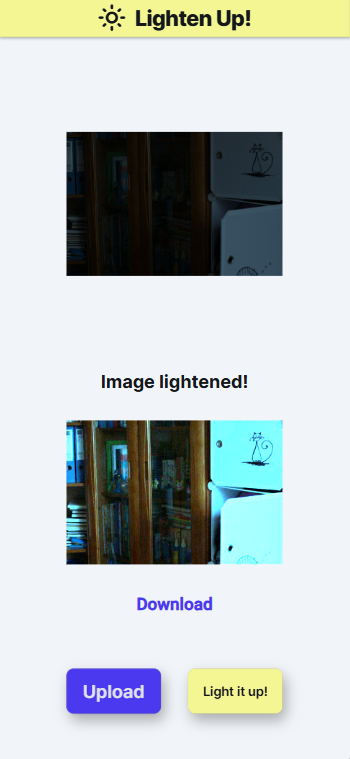

# Lighten Up!

**Lighten Up!** is an app developed with Flutter for low-light image enhancement using the Zero-DCE model trained on the LoL dataset.

## App Preview

### Main Features

- Upload media
- Enhance low-light image
- Download enhanced result

## Getting Started

This repository was pushed from FlutterFlow.
The APK is available for download to try.
